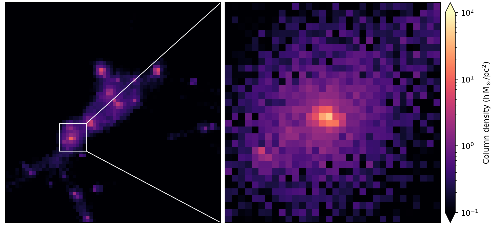

Cookbook
========

In this page, we show some example scripts written with ``mesh_illustris``. Feel free to contribute to this cookbook.

Load a box from TNG50-4-Subbox0
-------------------------------

TNG50-4-Subbox0 is a subbox of the TNG50 simulation. The center of this subbox is (26, 10, 26.5) Mpc/h, and the side length is 4 Mpc/h. We first load the entire subbox with the ``box()`` method of the ``Dataset`` object. Next, we laod a smaller 500 kpc/h box containing a Milky-Way mass galaxy also with the ``box()`` method. Finally, we make projection plots of gas for both boxes.

.. literalinclude:: cookbook/load_box.py
